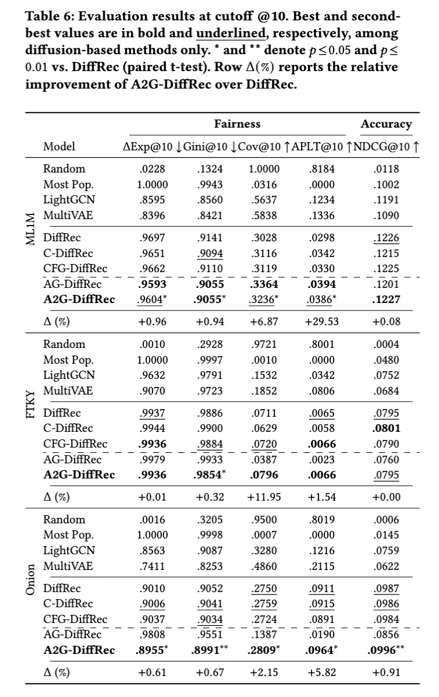
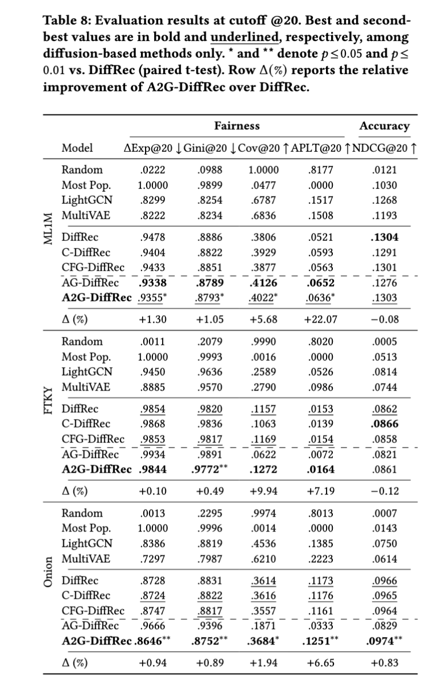
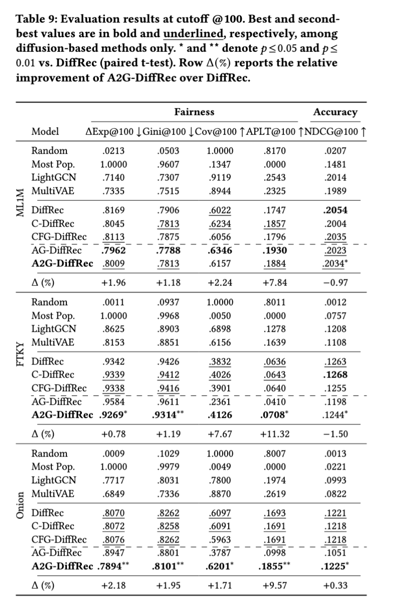

# Additional Results

This document contains extended experimental results for A2G-DiffRec.

All Δ%, metric changes, and tradeoffs are computed with respect to **DiffRec** as the baseline.[^1]

## Table of Contents
- [Results at different cutoffs](#results-at-different-cutoffs)
  - [Results at Cutoff K=10](#results-at-cutoff-k10)
  - [Results at Cutoff K=20](#results-at-cutoff-k20)
  - [Results at Cutoff K=100](#results-at-cutoff-k100)
- [Footnotes](#footnotes)

---

## Results at different cutoffs

### Results at Cutoff K=10

### Results at Cutoff K=20

### Results at Cutoff K=100

---
